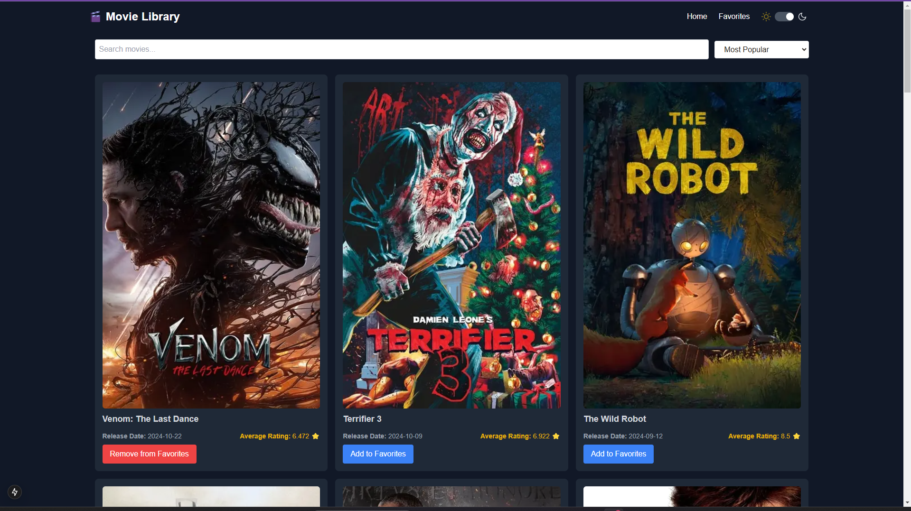

# Movie Library Application

This is a responsive, dynamic web application built using **Next.js**, **TypeScript**, and **Tailwind CSS**. The app fetches movie data from [The Movie Database (TMDb)](https://developer.themoviedb.org/reference/intro/getting-started) API and provides users with features like infinite scrolling, search, sorting, and adding/removing movies from their favorites.

---

## Features

- Display popular movies in a grid layout with infinite scrolling.
- Search movies by title.
- Sort movies by:
  - Most Popular
  - Future Releases
  - Oldest Releases
  - Highest Revenue
- Add or remove movies from favorites (persisted via localStorage).
- View detailed information about a movie, including its genres, overview, casts and average rating.
- Responsive design for mobile, tablet, and desktop devices.
- Animated skeleton loaders for better user experience during data fetching.
- "Go to Top" button for quick navigation.

---

## Getting Started

### Prerequisites

Make sure you have the following installed:

- **Node.js** (v16 or higher)
- **npm** (v8 or higher) or **yarn** (v1.22 or higher)

### Clone the Repository

```bash
git clone https://github.com/omolara5861/movie-library.git
cd movie-library
```

### Install Dependencies

Install the required packages:

```bash
npm install --legacy-peer-deps
```

OR

```bash
yarn install
```

### Set Up Environment Variables

Rename `.env.local` file in the root directory to `.env` and add the following:

```javascript
NEXT_PUBLIC_TMDB_API_KEY=your_api_key
NEXT_PUBLIC_TMDB_BASE_URL=https://api.themoviedb.org/3
NEXT_PUBLIC_TMDB_ACCESS_TOKEN=your_access_token
```

Replace `your_api_key` and `your_access_token` with your TMDb API key and token. You can get one from [TMDb API](Ihttps://developer.themoviedb.org/reference/intro/getting-started).
Depending on the secret you are using, pls confirm that's what is being used in the app via `app/utils/api.ts`. Else update it
*Note* Using `token` worked for me

### Run the Application

Start the development server:

```bash
npm run dev
```

Or

```bash
yarn dev
```

Open your browser and navigate to [http://localhost:3000](http://localhost:3000) to view the app.

## Design Decisions and Trade-Offs

### Design Choices

1. **Tech Stack**:

   - **Next.js** was chosen for its SSR and SSG capabilities, improving SEO and page load times.
   - **TypeScript** provides strong type enforcement, reducing runtime errors.
   - **Tailwind CSS** enables rapid UI development with a mobile-first approach.

2. **Infinite Scrolling**:

   - Implemented using the `react-infinite-scroll-component` library for cleaner code and easy integration.
   - Provides a better user experience compared to traditional pagination.

3. **Skeleton Loaders**:

   - Introduced animated skeleton loaders for seamless data-fetching feedback.
   - Replaced basic loaders to enhance visual appeal and user engagement.

4. **Favorites Management**:

   - Used `localStorage` to persist favorites for simplicity and offline access.
   - A full backend solution was avoided to keep the app lightweight.

5. **Sorting and Filtering**:

   - Sorting options were added to give users flexibility in exploring movies.
   - Filters exclude movies without images to maintain a polished UI.

6. **Responsive Design**:
   - Tailwind CSS ensures the app looks great on all devices, with grid layouts adjusting for different screen sizes.

---

### Trade-Offs

1. **No Backend**:

   - The app uses `localStorage` instead of a database to manage favorites and darkmode, which limits cross-device syncing but simplifies implementation

2. **Client-Side Search**:

   - Searching is limited to the currently loaded movies.

3. **Image-Focused Display**:

   - Movies and casts without posters are excluded to ensure a visually consistent experience. This may hide some movies and casts, but it improves UI quality.

4. **Simplified Error Handling**:
   - Basic error handling is implemented for API failures.

## Future Enhancements

- Implement darkmode
- Add a scroll to top button for easy navigation back to the top of the screen when a lot of movies loaded
- Add sorting options for movies
- Display similar movie options in details page
